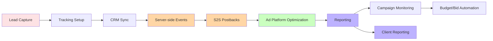

I'll research this thoroughly across practitioner sources. Let me start with parallel searches covering the major pain point areas.
Good initial results. Let me continue with more targeted searches on the remaining pain point areas.
Let me dig deeper into specific practitioner sources, tracker problems, and competitor service pages.
Let me gather more on agency client reporting, e-commerce, lead gen, and competitor service pages.
Let me get a few more specifics on competitor service pages, high-intent queries, and exact practitioner phrasing.
Let me open a few key practitioner sources to capture exact phrasing and specific technical details.
Let me gather a few more specifics on exact phrasing and competitor service offerings.
Let me do a final round of searches to capture exact phrasing on tracker-specific and lead-gen-specific issues.
# Research Report: Technical Pain Points in Marketing Data Integration & AdOps Automation

A structured analysis of the real, implementation-level problems faced by agencies, performance teams, affiliate media buyers, e-commerce teams, lead generation teams and in-house growth operations — grounded in practitioner discussions from Reddit, the Stape community, Google Ads API Forums, HubSpot/Zapier/Pipedrive communities, tracker documentation, competitor service pages and job posts.

---

## 1. Executive Summary

The single strongest commercial pain in this market is **the broken chain between an ad click and the revenue event that should be fed back to the ad platform's optimization engine.** When a lead enters a CRM, a purchase lands in Shopify, or a conversion fires in an affiliate network, that event must travel back to Meta CAPI, Google Ads Offline Conversions, Google Enhanced Conversions or TikTok Events API — and in the majority of real-world stacks it arrives late, deduplicated incorrectly, unmatched, or not at all. Practitioners describe this as "flying blind," "optimizing on incomplete data," and "making budget decisions based on guesswork"【turn1search7】【turn6search20】.

The five problems most likely to convert into paid service demand, ranked by urgency × willingness to pay, are:

1. **CAPI / Enhanced Conversions / Events API deduplication and event-match-quality failures** — Meta advertisers report duplicate Purchase and AddToCart events from event_id mismatches between browser and server【turn0search1】【turn0search4】, and Google Enhanced Conversions repeatedly throws "No user provided data was found" because hashed payloads are normalized incorrectly【turn0search5】【turn0search6】. TikTok EMQ scores below 5 mean "significant attribution problems even with events firing correctly"【turn7search12】.
2. **Google Ads Offline Conversion import breakages** — GCLID/GBRAID/WBRAID mismatch, "clicks too old," wrong account, "tag not filtering," and the structural gap that WBRAID/GBRAID are not importable through the standard GCLID path【turn1search5】【turn1search8】【turn1search9】【turn4search25】.
3. **Tracker postback (S2S) misconfiguration** — the most common reason a postback "fires but credits nothing" is a click-ID token mismatch between Voluum `{clickid}`, RedTrack `sub1–sub20`, Binom `{externalid}` and the affiliate network's expected token【turn2search13】【turn7search0】.
4. **Silent webhook / automation failures** — Facebook Lead Ads webhooks to Zapier silently drop leads (multiple confirmed cases where leads exist in Meta but never fire the Zapier trigger)【turn7search5】【turn7search7】, and webhook failures are described as "the most invisible cause of broken marketing automation" with API errors now driving 67% of all monitoring failures【turn5fetch1】【turn4search21】.
5. **Manual agency reporting drain** — agencies spend 15+ billable hours/week pulling data across platforms into Looker Studio/Sheets, and Supermetrics/Funnel.io pipelines are described as "unreliable" with removed free plans and opaque pricing【turn3search1】【turn3search2】【turn6search0】【turn6search2】.

**Why these create demand for a custom service (not a SaaS):** each failure is stack-specific. The fix requires reading API logs, normalizing payloads, building retry/idempotency layers, validating token mapping per-network, and wiring server-side GTM containers to CRM webhooks — work that no-code tools explicitly cannot do at scale【turn1search0】【turn5fetch1】. Competitor service pages (Measureu, Pilot Digital, Systemify, House of MarTech) price server-side tracking implementations at $2,000–$15,000, with advisory retainers at $50,000+【turn3search22】【turn3season2】, confirming a paid market for technical implementation rather than tool subscription.

---

## 2. Pain Matrix by Customer Segment

| Segment | Main technical pain | Typical tools involved | Business impact | Urgency | WTP | Suggested service angle |
|---|---|---|---|---|---|---|
| **Digital marketing agencies** | Manual multi-client reporting drains billable hours; per-client tracking setups break silently | Looker Studio, Google Sheets, Supermetrics, Funnel.io, Meta/Google/TikTok Ads APIs, GA4 | 15+ hrs/week lost per account team; clients question ROI when reports are late/wrong【turn3search0】【turn3search2】 | High | Medium-High | "Automated client reporting pipelines + per-client tracking audits on a managed retainer" |
| **Performance marketing teams** | CAPI/Enhanced Conversions deduplication and EMQ failures skew bidding signals | Meta CAPI, Google Enhanced Conversions, TikTok Events API, GTM Server, Stape, Shopify/WooCommerce | Bidding on incomplete data; CPAs inflate; cannot prove channel ROI【turn0search4】【turn7search12】 | Critical | High | "Server-side tracking implementation + event deduplication + EMQ optimization" |
| **Affiliate media buyers** | S2S postback mis-fires; bot traffic; tracker-to-network token mismatch; cloaking/filter setup | Keitaro, Binom, Voluum, RedTrack, BeMob, Adspect, affiliate network APIs | Conversions not credited = lost payout; scaling kills tracker performance; bot traffic drains budget【turn2search13】【turn3search25】【turn3search28】 | Critical | High | "Tracker + postback + TDS integration with bot filtering and CAPI bridge to ad sources" |
| **E-commerce marketing teams** | Shopify/WooCommerce tracking broken — losing 50–80% of conversion data; attribution mismatch between Shopify, Google Ads, Meta | Shopify, WooCommerce, GA4, Meta Pixel+CAPI, Google Enhanced Conversions, TikTok Events API | ROAS unknowable; Smart Bidding degrades; budget cut on healthy campaigns【turn3search8】【turn6search20】 | Critical | High | "E-commerce server-side tracking + revenue-back-to-ads feedback loop" |
| **Lead generation teams** | Facebook Lead Ads → CRM webhooks silently drop leads; offline conversions never reach ad platforms; lead scoring feedback loop broken | Facebook Lead Ads, Zapier/Make, HubSpot/Pipedrive/amoCRM, Google Ads Offline Import, Meta CAPI | Paying for leads that vanish before sales calls; ad platform optimizes toward junk form fills【turn7search5】【turn7search7】【turn3search13】 | Critical | High | "Lead capture reliability layer + CRM-to-ads conversion feedback with retries & monitoring" |
| **In-house growth / MarOps teams** | No single source of truth; Zapier/Make workflows hit limits; GA4→BigQuery→Looker pipeline fragile | GA4, BigQuery, Looker Studio, Segment, Zapier/Make/n8n, internal CRM/data warehouse | Engineering bottlenecks; data trust collapses; growth experiments blocked on data availability【turn1search0】【turn1search16】【turn3search17】 | Medium-High | Medium-High | "Marketing data warehouse + custom data pipeline with validation, logging, retries" |

---

## 3. Pain Matrix by Workflow Stage

The diagram above maps the ten workflow stages where things break. Each is detailed below.

### 3.1 Lead capture
**What breaks:** Facebook Lead Ads webhooks fail to fire for a subset of leads — they exist in Meta's Lead Center but never reach Zapier, Make or the CRM. Documented cases show `leadgen_id`s present in Meta but absent from Zapier history【turn7search5】【turn7search7】. A July 10th outage broke triggers across multiple client accounts simultaneously【turn7search8】.
**Why it breaks:** Meta's webhook delivery is best-effort; Zapier polls/relies on Meta's subscription which silently drops under load; no retry/idempotency on the receiving side.
**How teams solve it manually:** Daily CSV exports from Meta Lead Center, manual re-import to CRM, manual cross-check against Zapier history.
**What a service solves:** A direct Graph API polling fallback with webhook + polling dual-path, idempotency keys, dead-letter queue, and lead-loss alerting.

### 3.2 Tracking setup
**What breaks:** GTM tag sequencing regenerates unique event IDs across tags firing on the same event, breaking deduplication【turn2search2】. Enhanced Conversions throws "No user provided data was found" when hashed phone variables are misconfigured【turn0search5】. GA4 shows no conversion events after server-side install【turn0search11】.
**Why it breaks:** GTM variables re-evaluate on every access; developers hash before normalizing; server container event routing misconfigured.
**Manual fix:** Re-do the tag, test in GTM preview, wait 24–48h for diagnostics, repeat.
**Service solution:** Audited, version-controlled GTM container with event-ID persistence in the data layer, normalized+hashed user data, and diagnostic dashboards.

### 3.3 CRM sync
**What breaks:** HubSpot conversion events can't be used to optimize Facebook lead ads natively【turn0search20】. Bitrix24 inbound webhooks don't expire and leak = security risk, and many REST methods are unavailable via webhooks【turn2search6】. Pipedrive webhook community threads flag missing/duplicate events【turn4search5】. Zoho-Facebook integration breaks repeatedly【turn4search8】.
**Why it breaks:** Native CRM-to-ad-platform connectors cover only basic flows; webhook payloads differ per CRM; field mapping drifts after CRM schema updates.
**Manual fix:** Zapier glue workflows that break at scale.
**Service solution:** Custom bidirectional CRM↔ad-platform sync with field mapping config, webhook signature validation, retry queues and audit logs.

### 3.4 Server-side events
**What breaks:** Server-side tracking "sold like snake oil" — in many setups it's just endpoint substitution with no real signal recovery【turn2search22】. Stape/GCP hosting cost balloons at scale【turn6search13】【turn6search14】. Conversion data doesn't reach GA4 after server-side install【turn0search11】.
**Why it breaks:** Wrong container routing, missing client-side companion events, no deduplication IDs, cost-per-request pricing.
**Manual fix:** Trial-and-error container edits.
**Service solution:** Properly architected sGTM setup with event deduplication, consent-mode v2 handling, cost monitoring, and a documented event taxonomy.

### 3.5 S2S postbacks
**What breaks:** Postback fires but conversion isn't credited — because the click-ID token sent to the affiliate network doesn't match the tracker's expected parameter (Voluum `{clickid}` vs RedTrack `sub1` vs Binom `{externalid}` vs Everflow `nid`+`transaction_id`)【turn2search13】. Keitaro's own troubleshooting guide is essentially a multi-step "find where the postback died" checklist【turn7search0】.
**Why it breaks:** Each tracker + each network speaks a different token dialect; subIDs get overwritten by redirect chains; HTTPS/SSL misconfigured on secure postbacks.
**Manual fix:** Manually test postback URLs with `curl`, swap tokens, wait for next conversion.
**Service solution:** A postback-orchestration layer that normalizes tokens across trackers/networks, logs every hop, and auto-retries failed postbacks.

### 3.6 Ad platform optimization
**What breaks:** Smart Bidding optimizes toward form fills (junk leads) instead of revenue because the only signal fed back is a lead event, not qualified-lead or closed-won【turn6search24】. Google Ads Performance Max generates spam leads from click farms【turn1search9】. iOS 14+ ATT wiped out a large chunk of Meta attribution — spend stays "profitable on paper" but actual sales don't match【turn1search10】【turn1search13】.
**Why it breaks:** Offline conversion feedback loop is absent or delayed beyond the optimization window; conversion actions mislabeled.
**Manual fix:** Weekly CSV upload of offline conversions (described as the standard manual workaround)【turn1search6】.
**Service solution:** Automated CRM-stage→conversion-action mapping with value-based bidding signals, streamed via API with GCLID/WBRAID/GBRAID handling.

### 3.7 Reporting
**What breaks:** Meta shows 120 conversions, Google Ads shows 95, CRM shows 78 closed — three platforms, three realities【turn6search20】. GA4→BigQuery→Looker Studio pipelines are fragile and break on schema changes【turn1search16】. Supermetrics/Funnel.io "not robust enough for our scale," with removed free plans and opaque pricing【turn6search0】【turn6search2】.
**Why it breaks:** Each platform uses different attribution windows, dedup rules, and currency/timezone handling; connectors break when APIs version.
**Manual fix:** Export CSVs, pivot in Sheets, reconcile by hand.
**Service solution:** A warehouse-first pipeline (BigQuery/Looker) with normalized schema, scheduled refreshes, data-quality checks and reconciliation logic.

### 3.8 Campaign monitoring
**What breaks:** Webhook failures are silent — "the system that was supposed to flag the problem is the same system that stopped working"【turn4search21】. A 200 OK response can still carry incomplete data【turn5fetch1】. No alert fires; nobody notices until a customer calls.
**Why it breaks:** Most teams monitor tools, not connections; API errors now drive 67% of all monitoring failures【turn5fetch1】.
**Manual fix:** Periodic spot-checks, reactive fire-fighting.
**Service solution:** End-to-end transaction monitoring, heartbeat checks, anomaly detection on event counts, dead-letter queues with alerting.

### 3.9 Budget / bid automation
**What breaks:** Tracker lag at scale makes "event data unreliable" so rule-based pausing/scaling fires on stale data【turn3search25】. Voluum's revenue-based overage pricing penalizes scaling【turn7search23】. RedTrack's CAPI configuration "requires a level of technical investment smaller teams don't have"【turn7search23】.
**Why it breaks:** Real-time cost/revenue sync gaps; API rate limits; deduplication breaks inflating apparent spend.
**Manual fix:** Manual bid caps, conservative scaling.
**Service solution:** Reliable cost+revenue sync with idempotency, plus rules-engine integration for automated pausing/scaling on verified data.

### 3.10 Client reporting for agencies
**What breaks:** Billable hours consumed by mechanical reporting instead of strategy; "the biggest time-sinks are pulling data from too many platforms"【turn3search0】【turn3search2】. Manual Looker Studio + Sheets + email stacks don't scale with client count【turn3search3】.
**Why it breaks:** Each client has a different stack, different KPIs, different cadence; templated tools don't fit.
**Manual fix:** Weekly/daily manual pulls per client.
**Service solution:** White-label automated reporting pipeline with per-client templates, live dashboards, and anomaly alerts — sold as a managed retainer or value-added service【turn3search1】.

---

## 4. Top 30 Technical Problems

Below are the 30 most common, implementation-level problems, each with the fields requested.

**1. Meta CAPI event duplication (Purchase/AddToCart counted twice)**
- Who: Performance teams, e-commerce, agencies
- Tools: Meta CAPI, GTM Server, Shopify, Stape
- Symptoms: Conversions in Events Manager 2× actual; ROAS inflated; ad spend mis-allocated
- Root cause: `event_id` not aligned between browser pixel and server event → deduplication fails【turn0search1】【turn0search4】
- Business cost: Bidding on inflated data; budget burned on phantom conversions
- Service solution: Shared event_id generation in data layer, persisted across client+server
- Landing wording: "Stop double-counting conversions — fix Meta CAPI deduplication"

**2. Google Enhanced Conversions "No user provided data was found"**
- Who: Performance teams, lead gen, e-commerce
- Tools: Google Ads, GTM, Enhanced Conversions for web/leads
- Symptoms: Diagnostic warning persists; EC status "no recent data"【turn0search7】
- Root cause: Hashing before normalization; hashed phone variable misconfigured; data layer not passing user data【turn0search5】【turn0search6】
- Business cost: Reduced match rate → Smart Bidding degrades
- Service solution: Normalization-then-hashing pipeline with diagnostic verification
- Landing wording: "Get Enhanced Conversions to actually pass user data"

**3. Google Ads Offline Conversions not matching (GCLID too old / wrong account)**
- Who: Lead gen, performance teams, agencies
- Tools: Google Ads API, CRM, Offline Conversion Import
- Symptoms: Upload accepted but conversions never appear; "tag not filtering" error【turn1search8】【turn4search25】
- Root cause: GCLID older than click age window; conversion action type wrong; click belongs to different client account
- Business cost: Smart Bidding blind to offline revenue
- Service solution: Validated upload pipeline with click-age checks and account-scoping
- Landing wording: "Send closed-won revenue back to Google Ads — reliably"

**4. GBRAID/WBRAID not importable via standard GCLID path**
- Who: Performance teams, lead gen
- Tools: Google Ads API, iOS campaigns
- Symptoms: iOS-driven conversions lost from feedback loop【turn1search9】【turn4search28】
- Root cause: Apple-pushed identifiers require separate upload method
- Business cost: iOS revenue invisible to bidding
- Service solution: Identifier-aware upload handling GCLID+GBRAID+WBRAID
- Landing wording: "Don't lose iOS conversions — handle GBRAID/WBRAID correctly"

**5. TikTok Events API low Event Match Quality (EMQ < 5)**
- Who: E-commerce, performance teams
- Tools: TikTok Events API, GTM Server, WooCommerce/Shopify
- Symptoms: 50 events sent, 12 attributed; ROAS report mismatch【turn7search12】
- Root cause: Bare-minimum parameters sent; missing user identifiers【turn7search11】
- Business cost: Campaigns "running blind"; budget cut on healthy ads
- Service solution: Enriched payloads with full user_data + deduplication
- Landing wording: "Raise your TikTok EMQ score and recover lost attributions"

**6. Affiliate postback fires but conversion not credited**
- Who: Affiliate media buyers
- Tools: Keitaro, Binom, Voluum, RedTrack, BeMob + affiliate networks
- Symptoms: Conversion visible in network, blank in tracker【turn7search0】
- Root cause: Click-ID token mismatch between tracker and network (Voluum `{clickid}` vs RedTrack `sub1–sub20` vs Binom `{externalid}`)【turn2search13】
- Business cost: Lost payout attribution; wrong scaling decisions
- Service solution: Token-normalization postback layer with per-network mapping
- Landing wording: "Fix postbacks that fire but don't credit"

**7. Facebook Lead Ads webhook silently drops leads**
- Who: Lead gen teams, agencies
- Tools: Facebook Lead Ads, Zapier, Make, CRM
- Symptoms: Leads present in Meta Lead Center, absent from CRM/Zapier history【turn7search5】【turn7search7】
- Root cause: Meta webhook subscription best-effort; no retry; idempotency absent
- Business cost: Paid leads never contacted; sales pipeline leaks
- Service solution: Graph API polling + webhook dual-path with idempotency + alerts
- Landing wording: "Stop losing Facebook leads between Meta and your CRM"

**8. Webhook silent failures (no alert, no log)**
- Who: All segments
- Tools: Shopify, Stripe, Klaviyo, HubSpot, Zapier, custom endpoints
- Symptoms: Customer buys, no confirmation email, no CRM update, no error【turn5fetch1】
- Root cause: API errors = 67% of monitoring failures; teams monitor tools not connections【turn4search21】
- Business cost: Silent revenue loss; trust erosion
- Service solution: Dead-letter queue, heartbeat monitoring, anomaly detection
- Landing wording: "Catch silent webhook failures before your customers do"

**9. GTM tag sequencing breaks event ID deduplication**
- Who: Performance teams, MarOps
- Tools: GTM Web + Server
- Symptoms: Same event counted multiple times; event coverage low【turn2search2】
- Root cause: GTM variables re-evaluate on access → event_id regenerates per tag
- Business cost: Inflated conversions; dedup failures
- Service solution: Event_id persisted in data layer, read once per event
- Landing wording: "Fix GTM event deduplication the right way"

**10. UTM parameter inconsistency → 35% attribution data loss**
- Who: All segments
- Tools: GA4, ad platforms, CRMs, Sheets
- Symptoms: "(not set)" values, duplicate entries, fragmented campaigns【turn2search24】【turn2search25】
- Root cause: Typos, case mismatch, mixed separators, manual UTM building
- Business cost: ~35% of campaign attribution lost【turn2search25】
- Service solution: Enforced UTM builder + normalization layer in pipeline
- Landing wording: "Kill UTM chaos — enforce a single naming standard"

**11. Shopify conversion tracking broken, losing 50–80% of data**
- Who: E-commerce teams
- Tools: Shopify, GA4, Meta, Google Ads
- Symptoms: Conversions down 40%+; CPAs look terrible; campaigns actually fine【turn3search8】【turn6search29】
- Root cause: iOS updates + ad blockers wiped client-side pixel data
- Business cost: Budget cut on healthy campaigns
- Service solution: Server-side tracking migration with CAPI/Enhanced Conversions
- Landing wording: "Recover the 50–80% of conversions you're losing on Shopify"

**12. CRM-to-ad-platform attribution gap (HubSpot ↔ Meta)**
- Who: Lead gen, in-house growth
- Tools: HubSpot, Meta CAPI, Able CDP
- Symptoms: Customers from FB ads not recognized when they convert in HubSpot; conversions not attributed to FB【turn0search24】
- Root cause: No shared identifier; no CAPI event from CRM
- Business cost: FB bidding blind to CRM-confirmed revenue
- Service solution: CRM→CAPI webhook bridge with hashed user data
- Landing wording: "Close the gap between HubSpot and Meta CAPI"

**13. Bitrix24/amoCRM webhook limitations**
- Who: Lead gen, affiliate (CIS market), agencies
- Tools: Bitrix24, amoCRM (Kommo), custom integrations
- Symptoms: Webhooks can't access certain REST methods; webhook URL leak = security risk【turn2search6】
- Root cause: Webhook design lacks app context; non-expiring tokens
- Business cost: Integration broken or insecure
- Service solution: OAuth-based app integration instead of raw webhooks, with token rotation
- Landing wording: "Build secure Bitrix24/amoCRM integrations that don't break"

**14. Zapier/Make workflow hitting task/complexity limits**
- Who: Lead gen, agencies, small in-house teams
- Tools: Zapier, Make, n8n
- Symptoms: Workflows "just couldn't scale"; cost balloons per step【turn1search0】【turn1search1】
- Root cause: Per-step pricing; no error branching; no custom code at scale
- Business cost: Runaway tool costs; fragile automations
- Service solution: Migrate critical workflows to n8n/custom code with proper error handling
- Landing wording: "Replace fragile Zapier stacks with reliable custom automation"

**15. Supermetrics/Funnel.io unreliable pipelines + opaque pricing**
- Who: Agencies, in-house growth
- Tools: Supermetrics, Funnel.io, Looker Studio, BigQuery
- Symptoms: "Unreliable data pipelines"; free plan removed; pricing calculator hidden【turn6search0】【turn6search2】
- Root cause: Connector breakage on API changes; pricing not predictable
- Business cost: Reporting delays; unexpected cost spikes
- Service solution: Direct API→warehouse pipeline owned and maintained by technical partner
- Landing wording: "Own your marketing data pipeline — stop renting fragile connectors"

**16. GA4 → BigQuery → Looker Studio pipeline fragile**
- Who: In-house growth, agencies
- Tools: GA4, BigQuery, Looker Studio
- Symptoms: Schema changes break dashboards; data not lining up【turn1search16】
- Root cause: GA4 export schema evolves; raw event data needs transformation
- Business cost: Dashboards stop working; trust in data collapses
- Service solution: Versioned transformation layer with schema-change monitoring
- Landing wording: "Production-grade GA4→BigQuery→Looker pipelines"

**17. iOS 14+ ATT attribution loss on Meta**
- Who: Performance teams, e-commerce, agencies
- Tools: Meta Ads, Pixel, CAPI
- Symptoms: Spend profitable on paper, sales don't match; "Apple screwed us"【turn1search10】【turn1search13】
- Root cause: ATT opt-out breaks client-side attribution
- Business cost: ROAS unknowable; budget mis-allocated
- Service solution: Server-side tracking + CAPI + modeled conversions
- Landing wording: "Recover attribution lost to iOS privacy changes"

**18. Ad blocker / cookie loss wipes client-side data**
- Who: All segments
- Tools: Pixels, GTM Web
- Symptoms: 10–20%+ conversions missed【turn1search21】; conversions down with no campaign change
- Root cause: Ad blockers kill pixel; third-party cookies deprecated
- Business cost: Under-reported performance; healthy campaigns cut
- Service solution: Server-side tagging with first-party domain
- Landing wording: "Bypass ad blockers with server-side tracking"

**19. Conversion Action "inactive — tag not filtering" (Google Ads API)**
- Who: Lead gen, agencies uploading on behalf of clients
- Tools: Google Ads API, Offline Conversion Upload
- Symptoms: Conversion action shows inactive; uploads rejected【turn1search8】
- Root cause: Client can't implement Google Tag; conversion action type mismatch
- Business cost: Cannot feed offline conversions to bidding
- Service solution: Hybrid setup with proper conversion action + identifier strategy
- Landing wording: "Fix inactive Google Ads conversion actions"

**20. Tracker performance degrades at scale (lag, unreliable events)**
- Who: Affiliate media buyers
- Tools: Keitaro, Binom, self-hosted trackers
- Symptoms: Tracker lags; split tests can't run reliably; "change tool on the fly — lose data"【turn3search25】
- Root cause: Self-hosted server limits; DB write bottlenecks
- Business cost: Wrong winners in split tests; lost ad spend
- Service solution: Tracker optimization/migration + caching layer + monitoring
- Landing wording: "Scale your tracker without losing data"

**21. Bot traffic / ad fraud draining budget**
- Who: Affiliate media buyers, e-commerce
- Tools: Binom, Adspect, trackers, filters
- Symptoms: "$1 lost for every $3 spent on digital ads" to fraud【turn3search28】
- Root cause: Botnets like Chameleon mimic humans; filter rules outdated
- Business cost: Direct budget loss to fraud
- Service solution: TDS/cloaking integration with bot filtering + monitoring
- Landing wording: "Filter bot traffic before it drains your ad budget"

**22. Voluum revenue-based overage pricing penalizes scaling**
- Who: Affiliate media buyers
- Tools: Voluum
- Symptoms: Costs scale unpredictably with campaign success【turn7search23】
- Root cause: Pricing tied to revenue tracked
- Business cost: Scaling = paying more for the tool
- Service solution: Migration to self-hosted or flat-fee tracker + custom cost sync
- Landing wording: "Stop paying more to scale — migrate your tracker"

**23. RedTrack CAPI/dedup configuration too technical for solo operators**
- Who: Affiliate media buyers, small performance teams
- Tools: RedTrack, CAPI
- Symptoms: CAPI events not firing; dedup broken; "configuration takes time"【turn7search23】
- Root cause: Tool flexibility = complexity
- Business cost: CAPI not working → ad source optimization blind
- Service solution: Managed RedTrack + CAPI setup with validation
- Landing wording: "Get RedTrack CAPI firing correctly — done for you"

**24. Lead scoring feedback loop broken**
- Who: Lead gen, in-house growth
- Tools: HubSpot, Pipedrive, Salesforce, custom scoring
- Symptoms: "High-score" leads are poor fits; sales loses trust in scoring【turn3search13】
- Root cause: Scoring not calibrated to closed-won; no feedback from sales to model
- Business cost: Sales wasting time on bad leads
- Service solution: Closed-loop scoring with CRM-stage feedback into the model
- Landing wording: "Build a lead scoring loop that sales actually trusts"

**25. Ad platform reporting mismatch (Meta vs Google vs CRM)**
- Who: All segments
- Tools: Meta Ads, Google Ads, CRM
- Symptoms: 120 vs 95 vs 78 conversions for same period【turn6search20】
- Root cause: Different attribution windows, dedup rules, definitions
- Business cost: Cannot prove ROI; budget decisions on contradictory data
- Service solution: Unified warehouse with reconciliation logic
- Landing wording: "One source of truth across Meta, Google and your CRM"

**26. Consent Mode v2 / EU tracking limitations**
- Who: E-commerce, performance teams (EU)
- Symptoms: Installs/events not showing in Meta Ads Manager (EU)【turn1search12】
- Root cause: Consent Mode not implemented; EU user data policy non-compliant
- Business cost: EU conversions invisible
- Service solution: Consent Mode v2 + server-side with consent-aware routing
- Landing wording: "Stay compliant in the EU without losing conversions"

**27. API token expiry / credential rotation breaks integrations silently**
- Who: All segments
- Tools: All API-based integrations
- Symptoms: Integration stops working after IT rotates credentials; no alert【turn5fetch0】
- Root cause: Tokens expire; permissions revoked after team changes
- Business cost: Silent tracking blackout for days
- Service solution: Token-refresh automation + health-check monitoring
- Landing wording: "Never lose tracking to expired API tokens again"

**28. Server-side tracking sold as endpoint substitution (no real signal recovery)**
- Who: Performance teams, agencies
- Tools: sGTM, Stape
- Symptoms: Server-side installed, EMQ unchanged; "snake oil"【turn2search22】
- Root cause: Just moving pixel to server, not enriching/normalizing data
- Business cost: Paid for implementation, got no lift
- Service solution: Properly architected sGTM with enrichment + dedup + EMQ optimization
- Landing wording: "Server-side tracking that actually recovers conversions"

**29. Affiliate network cost data not syncing to tracker**
- Who: Affiliate media buyers
- Tools: RedTrack, Voluum, network APIs
- Symptoms: "Don't allow for automatic cost transfer" — only pause campaigns【turn7search20】
- Root cause: Network API limitations; no cost-import template
- Business cost: ROAS unknowable; manual cost entry
- Service solution: Custom cost-import bridge per network
- Landing wording: "Auto-sync ad spend into your tracker"

**30. Manual agency client reporting drains 15+ hrs/week**
- Who: Digital agencies
- Tools: Meta/Google/TikTok Ads Managers, Sheets, Looker Studio
- Symptoms: Billable time on mechanical reporting; "pulling data from too many platforms"【turn3search0】【turn3search2】
- Root cause: No unified pipeline; per-client manual pulls
- Business cost: Lost billable hours; late reports; client churn risk
- Service solution: Automated white-label reporting pipeline with live dashboards
- Landing wording: "Automate client reporting — reclaim 15+ hours a week"

---

## 5. High-Intent Search Queries

Grouped by intent, these are phrases practitioners actually type when seeking a technical specialist (drawn from Upwork freelancer titles, job posts, Reddit threads and competitor pages).

**API integration intent**
- Google Ads API integration developer
- Meta Marketing API developer for hire
- TikTok Ads API integration specialist
- custom API integration for marketing
- marketing data pipeline developer
- webhook developer for marketing automation
- Google Ads API offline conversion upload developer【turn4search25】

**CRM integration intent**
- CRM to Facebook CAPI integration
- HubSpot to Meta Conversions API setup【turn0search23】
- Salesforce to Google Ads offline conversions
- Pipedrive webhook integration developer
- Bitrix24 API integration specialist
- amoCRM to ad platform sync
- Zoho to Facebook integration fix【turn4search8】
- CRM to ads feedback loop

**Conversion tracking intent**
- Google Ads offline conversions setup
- Google Enhanced Conversions setup specialist
- enhanced conversions for leads setup
- conversion tracking broken fix
- conversion deduplication specialist
- GA4 conversion tracking setup
- Shopify conversion tracking fix

**Server-side tracking intent**
- Meta Conversion API specialist
- server-side tracking developer
- server-side GTM implementation
- Stape server container setup
- GTM server-side tracking expert【turn6search5】
- TikTok Events API setup
- consent mode v2 implementation
- server-side tracking for agencies

**Postback / affiliate tracking intent**
- Keitaro postback integration【turn7search0】
- Binom tracker integration
- Voluum postback setup
- RedTrack CAPI integration
- affiliate tracker S2S postback setup
- postback not firing fix
- affiliate network token mapping
- tracker migration specialist

**Reporting automation intent**
- automated marketing reporting
- Looker Studio dashboard developer
- Supermetrics alternative setup
- BigQuery marketing data warehouse
- GA4 to BigQuery pipeline
- Funnel.io alternative【turn6search0】
- agency client reporting automation

**AdOps automation intent**
- adops automation services
- automated marketing data pipelines
- marketing automation engineer hire
- MarTech engineer for hire【turn2search14】
- growth engineer marketing operations
- Replace Zapier with custom automation
- campaign budget automation scripts

**Troubleshooting intent**
- fix Meta CAPI duplicate events
- Enhanced Conversions no user data found
- Facebook Lead Ads missing leads Zapier
- Google Ads conversion action inactive
- TikTok EMQ low how to improve
- postback fires but no conversion
- webhook not firing fix
- GA4 not showing conversions after server-side

---

## 6. Landing Page Messaging Recommendations

**Best H1 options**
- "Marketing Data Integration & AdOps Automation Services"
- "Stop Losing Conversions Between Your CRM and Ad Platforms"
- "Server-Side Tracking, CAPI & Postback Integration — Done Right"
- "Marketing Data Pipelines That Don't Break"

**Best hero subtitle options**
- "We connect trackers, CRMs and ad platforms with reliable server-side events, postbacks and automated reporting — so you stop optimizing on incomplete data."
- "Custom API integrations, CAPI/Enhanced Conversions setup, S2S postback flows and warehouse-grade reporting — built and maintained by technical specialists."
- "Replace fragile Zapier stacks and manual reporting with production-grade marketing data infrastructure."

**Main pain points to use above the fold**
- "Conversions lost between CRM and ad platforms"
- "Duplicate events breaking Meta CAPI"
- "Postbacks that fire but don't credit"
- "Silent webhook failures nobody notices"
- "15+ hours/week lost to manual client reporting"
- "iOS privacy and ad blockers wiping your tracking"

**Service blocks to include**
1. Server-Side Tracking & sGTM Implementation (Meta CAPI, Google Enhanced Conversions, TikTok Events API)
2. CRM-to-Ad-Platform Feedback Loops (HubSpot, Salesforce, Pipedrive, Bitrix24, amoCRM, Zoho)
3. Affiliate Tracker & Postback Integration (Keitaro, Binom, Voluum, RedTrack, BeMob)
4. Google Ads Offline Conversions & Enhanced Conversions for Leads
5. Webhook & API Integration with Retries, Logging & Monitoring
6. Marketing Data Warehouse & Reporting Automation (GA4, BigQuery, Looker Studio)
7. AdOps Automation Scripts (budget/bid rules, campaign monitoring, anomaly alerts)
8. Tracking Audits & Deduplication Fixes
9. White-Label Agency Reporting Pipelines
10. Zapier/Make → Custom Code Migration

**Use cases to feature**
- E-commerce store recovering 50–80% lost conversions on Shopify
- Agency automating client reporting, reclaiming 15+ hrs/week【turn3search2】
- Affiliate media buyer fixing postback token mismatch across 5 networks
- Lead gen team closing the Facebook Lead Ads → CRM gap
- In-house growth team building GA4→BigQuery→Looker warehouse

**FAQ questions**
- "What's the difference between Meta CAPI and the pixel — and do I need both?"
- "Why are my Enhanced Conversions showing 'no user data found'?"
- "How long does a server-side tracking implementation take?"
- "Can you fix postbacks on Keitaro/Binom/Voluum/RedTrack?"
- "Do you work with Bitrix24/amoCRM?"
- "Can you migrate us off Zapier/Make without breaking workflows?"
- "How do you handle iOS consent mode and EU users?"
- "Do you offer white-label reporting for agencies?"
- "What does a typical engagement cost?" (anchor on $2k–$15k range【turn3search22】)

**CTA wording**
- "Get a tracking audit"
- "Book a MarTech integration call"
- "Diagnose my broken conversions"
- "Automate my reporting"
- "Request a postback fix"

**Technical terms that should appear on the page**
Server-side tracking, sGTM, Meta CAPI, Conversions API, Google Enhanced Conversions, Enhanced Conversions for Leads, TikTok Events API, Event Match Quality (EMQ), event deduplication, event_id, GCLID, GBRAID, WBRAID, offline conversion import, S2S postback, postback URL, click ID, subID, webhook, dead-letter queue, idempotency, retry, consent mode v2, SHA-256 hashing, user-provided data, data layer, GTM server container, Stape, BigQuery, Looker Studio, GA4, marketing data warehouse, TDS, cloaking, bot filtering.

**Terms to avoid (too generic or too enterprise-heavy)**
- "Digital transformation"
- "Data-driven marketing" (without workflow tie-in)
- "Synergy" / "holistic" / "360-degree view"
- "Enterprise data lake" / "ETL/ELT theory" without marketing context
- "MarTech stack optimization" (vague)
- "Improve efficiency" (without a named workflow)
- "Big data" / "AI-powered insights" (unless concrete)

---

## 7. Content Angles

Ten strong, practitioner-grounded content angles for the service page:

1. **"Stop losing conversions between CRM and ad platforms"** — anchored on the 120/95/78 mismatch problem【turn6search20】
2. **"Replace manual reporting with automated marketing data pipelines"** — anchored on 15+ hrs/week agency drain【turn3search2】
3. **"Connect trackers, CRMs and ad platforms with reliable postback flows"** — anchored on token mismatch【turn2search13】
4. **"Build a CRM-to-ads feedback loop for better optimization"** — anchored on Smart Bidding optimizing toward junk leads【turn6search24】
5. **"Automate repetitive AdOps work without hiring more operators"** — anchored on manual CSV uploads【turn1search6】
6. **"Fix Meta CAPI duplicate events and raise your Event Match Quality"** — anchored on dedup bug【turn0search4】
7. **"Recover conversions lost to iOS, ad blockers and cookie deprecation"** — anchored on 50–80% Shopify loss【turn3search8】
8. **"Catch silent webhook failures before your customers do"** — anchored on 67% monitoring failures【turn5fetch1】
9. **"Migrate off fragile Zapier/Make stacks to reliable custom automation"** — anchored on scaling limits【turn1search0】
10. **"Get Google Ads Enhanced Conversions and Offline Conversions actually passing data"** — anchored on "no user data found"【turn0search5】

---

## 8. Evidence and Source Notes

| Finding | Source type |
|---|---|
| Meta CAPI deduplication bug, duplicate Purchase/AddToCart | Reddit r/FacebookAds & r/PPC threads【turn0search1】【turn0search4】 |
| Google Enhanced Conversions "no user provided data found" | Reddit r/GoogleTagManager + Google Ads API Forum【turn0search5】【turn0search6】 |
| TikTok EMQ <5 = significant attribution problems | Triplewhale blog + Seresa guide【turn7search10】【turn7search12】 |
| Google Ads Offline Conversion upload errors (GCLID/age/account) | Google Ads API docs + Google Groups【turn1search5】【turn4search25】 |
| GBRAID/WBRAID not importable via GCLID | YouTube practitioner video + Google Groups【turn1search9】【turn4search28】 |
| Conversion action "inactive — tag not filtering" | Google Ads API Forum【turn1search8】 |
| Tracker postback token mismatch (Voluum/RedTrack/Binom) | SMS Edge affiliate postback guide【turn2search13】 |
| Keitaro postback troubleshooting steps | Keitaro official docs【turn7search0】 |
| Facebook Lead Ads missing leads in Zapier | Zapier Community + Facebook Developer Forum【turn7search5】【turn7search7】 |
| Webhook silent failures, 67% monitoring failures | House of MarTech blog + LinkedIn【turn5fetch1】【turn4search21】 |
| GTM tag sequencing event ID mismatch | Stape blog【turn2search2】 |
| UTM inconsistency = 35% data loss | Brixon Group + Cometly guides【turn2search24】【turn2search25】 |
| Shopify losing 50–80% of conversion data | Reddit r/Google_Ads【turn3search8】 |
| iOS 14 ATT attribution loss | Reddit r/PPC & r/FacebookAds【turn1search10】【turn1search13】 |
| HubSpot ↔ Meta CAPI attribution gap | Able CDP integration page + HubSpot Community【turn0search24】【turn0search20】 |
| Bitrix24 webhook limitations/security | Bitrix24 REST API docs【turn2search6】 |
| Pipedrive webhook issues | Pipedrive Developers' Community【turn4search5】 |
| Zoho-Facebook integration problems | Zoho Cares community【turn4search8】 |
| Zapier/Make/n8n scaling limits | Reddit r/n8n + comparison blogs【turn1search0】【turn1search1】 |
| Supermetrics/Funnel.io unreliable pipelines, pricing | Reddit r/PPC【turn6search0】【turn6search2】 |
| GA4→BigQuery→Looker pipeline fragility | Reddit r/bigquery【turn1search16】 |
| Agency manual reporting 15+ hrs/week | Reddit r/PPC + Systemify case study + LinkedIn【turn3search0】【turn3search2】【turn3search1】 |
| Ad platform reporting mismatch (Meta vs Google vs CRM) | Cometly guide + Reddit r/PPC【turn6search20】【turn6search22】 |
| Bot traffic / ad fraud cost | Binom articles【turn3search28】 |
| Tracker lag at scale, data unreliable | ProxyWing guide【turn3search25】 |
| Voluum revenue-based overage pricing | Roaspy comparison【turn7search23】 |
| RedTrack CAPI complexity | Roaspy comparison【turn7search23】 |
| Lead scoring broken feedback loop | LinkedIn (Kevin White)【turn3search13】 |
| Server-side tracking "snake oil" | Reddit r/GoogleTagManager【turn2search22】 |
| EU consent / installs not showing | Reddit r/FacebookAds【turn1search12】 |
| MarTech Engineer job requirements | LinkedIn job post【turn2search14】 |
| Upwork freelancer titles (CAPI/server-side specialists) | Upwork profiles【turn6search5】【turn6search9】 |
| Competitor service pricing ($2k–$15k, $50k+ advisory) | Measureu service page【turn3search22】 |
| Stape agency white-label program | Stape for-agencies page【turn6search25】 |
| Server-side tracking case study (40% conversion drop was measurement) | Coby Agency blog【turn6search29】 |
| Affiliate trackers 2026 landscape (S2S postback = gold standard) | iAmAttila tracker review【turn3search26】 |
| CRM-to-Google-Ads conversion feedback methodology | RioStack blog【turn6search24】 |

The evidence base leans heavily on practitioner forums (Reddit, Zapier Community, Google Ads API Forum, Stape Community, HubSpot Community, Pipedrive/Bitrix24 dev communities), tracker official documentation, competitor service pages (Measureu, Pilot Digital, Systemify, House of MarTech, Coby Agency, Stape for-agencies), job posts (LinkedIn, Indeed) and freelancer marketplaces (Upwork, Arc.dev) — aligning with the brief's priority on real practitioner signal over enterprise ETL theory.